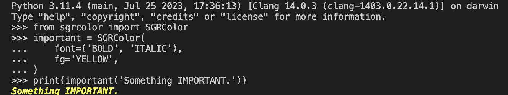

.. template documentation master file, created by
   sphinx-quickstart on Sun Jul  9 16:38:41 2023.
   You can adapt this file completely to your liking, but it should at least
   contain the root `toctree` directive.

Select Graphic Rendition Color
====================================

Contents
------------------------------------

.. toctree::
   :maxdepth: 2
   :caption: Contents:

   modules

Summary
-------------

SGRColor module let you color your output with Select Graphic Rendition Code.

|example|

Requirements
-------------

System
^^^^^^^^^^^^^

- ``python >= 3.10.10``

Python
^^^^^^^^^^^^^

- ``Nothing``

Setup
-------------

Installation
^^^^^^^^^^^^^

- Install with Python pip

.. code-block:: shell

   >>> pip install sgrcolor-2.0.0-py3-none-any.whl

Usage
-------------

Start Up
^^^^^^^^^^^^^

- Import this Project as a module.

.. code-block:: python

   from sgrcolor import (
      Reset,
      Font,
      FG,
      BG,
      SGRColor
   )
   print(FG.BLUE, 'foobar', FG.RESET)

   important = SGRColor(
      font=('BOLD', 'ITALIC'),
      fg='YELLOW',
   )
   print(important('Something IMPORTANT.'))

Run the tests
--------------

- Unit tests

.. code-block:: shell

   >>> python -m tests

Support
--------------

Author
^^^^^^^^^^^^^^

- ``yveschen2718@gmail.com``

Maintainer
^^^^^^^^^^^^^^

- ``yveschen2718@gmail.com``

